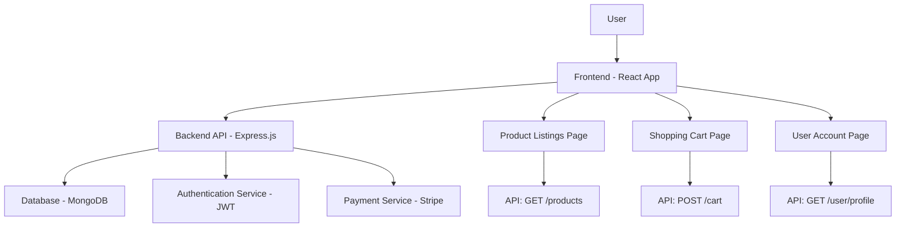

# E-commerce Web App Architecture Plan

## Overview
This plan outlines the architecture for building an e-commerce web application with product listings, shopping cart, and user accounts, based on the existing Node.js Express backend.

## Key Components
- **Backend**: Enhanced Express.js API with authentication, product management, cart, and orders
- **Frontend**: React application for user interface
- **Database**: MongoDB for data storage
- **Authentication**: JWT-based user authentication
- **Payment**: Stripe integration for payments
- **Deployment**: AWS services (EC2, S3, etc.)

## System Architecture Diagram

## Todo List
The following actionable steps will be executed in order:
- Analyze current project structure and dependencies
- Design system architecture including backend API, frontend, and database
- Set up database (e.g., MongoDB) and define schemas for users, products, and orders
- Implement user authentication (registration, login, JWT)
- Create API endpoints for product management (CRUD operations)
- Implement shopping cart functionality (add/remove items, persist cart)
- Build frontend interface using React for product listings and cart
- Integrate frontend with backend APIs
- Add payment processing (e.g., Stripe integration)
- Implement order management and history
- Add testing for key features
- Update deployment configuration for AWS